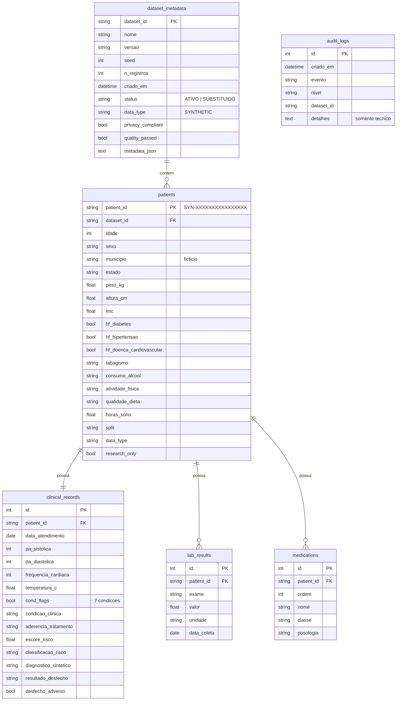
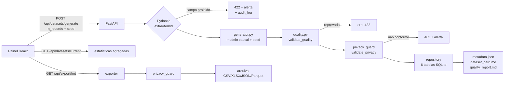

# Arquitetura

> **DATASET SINTÉTICO — NÃO CONTÉM DADOS REAIS DE PACIENTES**

Este documento descreve as decisões de arquitetura do gerador de dataset sintético de pacientes.

## 1. Estrutura de pastas

```
dataset-sintetico-pacientes/
├── backend/
│   ├── app/
│   │   ├── dataset_schema.py   # dicionário de dados: fonte única de verdade das variáveis
│   │   ├── generator.py        # gerador sintético (modelo causal + seed)
│   │   ├── quality.py          # validações de qualidade e relatório
│   │   ├── privacy_guard.py    # camada de privacidade: validate_privacy(dataset)
│   │   ├── exporter.py         # CSV, XLSX, JSON, Parquet (sempre após o privacy_guard)
│   │   ├── metadata.py         # metadata.json e Dataset Card
│   │   ├── repository.py       # persistência normalizada e reconstrução da tabela plana
│   │   ├── service.py          # orquestração e estatísticas do painel
│   │   ├── audit.py            # logs técnicos (sem dados pessoais)
│   │   ├── public_datasets.py  # base pública real UCI Heart Disease (separada do sintético)
│   │   ├── models.py           # 6 tabelas SQLAlchemy
│   │   ├── database.py, config.py, schemas.py
│   │   └── main.py             # API FastAPI
│   ├── requirements.txt, requirements-dev.txt
│   └── Dockerfile
├── frontend/                   # React + Vite + TypeScript + Tailwind (painel)
│   └── src/ (App.tsx, api.ts, components/Charts.tsx, components/DataViewer.tsx)
├── data/                       # dataset de exemplo, splits, metadata, dataset card, relatórios
├── tests/                      # pytest (geração, IMC, qualidade, privacidade, exportação, integridade, API)
├── docs/                       # arquitetura.md, metodologia.md
├── scripts/                    # CLI de geração, relatório de qualidade, baseline de ML, setup/run
├── README.md, LICENSE, .env.example, .gitignore, docker-compose.yml, pytest.ini
```

## 2. Tecnologias

| Camada | Tecnologia | Papel |
|---|---|---|
| Linguagem | Python 3.12 | backend, gerador, scripts |
| API | FastAPI + Uvicorn | endpoints REST, documentação OpenAPI em `/docs` |
| Validação de entrada | Pydantic v2 (`extra="forbid"`) | rejeita campos não previstos (ex.: `cpf`) |
| Banco | SQLite + SQLAlchemy 2 | armazenamento normalizado; trocável por PostgreSQL via `DATABASE_URL` |
| Geração | NumPy (PCG64) + Faker pt_BR | aleatoriedade reprodutível; identificadores e nomes de municípios inventados |
| Análise/exportação | Pandas, PyArrow, XlsxWriter | CSV, Parquet, JSON, XLSX |
| ML (scripts) | scikit-learn | experimento baseline |
| Frontend | React 19, Vite, TypeScript, Tailwind CSS 4, Recharts | painel |
| Testes | pytest, httpx (TestClient) | testes automatizados |
| Contêineres (opcional) | Docker, docker-compose, nginx | execução isolada |

## 3. Modelo de banco



Nenhuma tabela tem coluna para nome, CPF, RG, CNS, prontuário, telefone, e-mail, endereço ou data de nascimento.
O banco mantém um único dataset **ATIVO**; ao gerar um novo, o anterior é removido e registrado como `SUBSTITUIDO`
em `dataset_metadata` (a troca é atômica: tudo ocorre em uma transação).

Para análise e ML a aplicação usa a **tabela plana** (1 linha por paciente, 50 colunas), reconstruída por
`repository.load_dataset_frame`. O teste `test_ida_e_volta_preserva_dados` garante que gravar e reler produz
exatamente o mesmo DataFrame.

## 4. Fluxo da aplicação



Endpoints principais:

| Método | Rota | Descrição |
|---|---|---|
| POST | `/api/datasets/generate` | gera (100, 1.000, 10.000 ou 100.000), valida e grava |
| GET | `/api/datasets/current` | informações + estatísticas agregadas do painel |
| GET | `/api/datasets/current/patients` | registros paginados (filtro por partição) |
| POST | `/api/privacy/validate` | executa `validate_privacy` no dataset ativo |
| POST | `/api/privacy/check-fields` | testa apenas **nomes** de colunas contra a lista proibida |
| GET | `/api/quality` | executa `validate_quality` |
| GET | `/api/export/{csv,xlsx,json,parquet}` | exporta (bloqueia se não conforme) |
| GET | `/api/audit-logs` | eventos técnicos |

## 5. Mecanismo de geração

O gerador (`backend/app/generator.py`) segue um **modelo causal simplificado e fictício**, para que existam
relações aprendíveis — e não apenas números independentes:

1. **Demografia:** idade ~ Normal(48, 17) truncada em [18, 90] por reamostragem; sexo ~ Bernoulli(0,51);
   município sorteado de 120 nomes **inventados** (prefixo + radical + sufixo), cada um associado a uma UF.
2. **Histórico familiar e hábitos:** Bernoulli/categóricas; tabagismo e álcool um pouco mais frequentes no sexo M;
   sedentarismo cresce com a idade.
3. **Antropometria:** altura por sexo; IMC latente = f(idade, atividade, dieta, álcool) + ruído; peso = IMC × altura²;
   o IMC final é **recalculado** a partir do peso e altura arredondados (consistência exata).
4. **Condições:** probabilidade logística, p = σ(β·x), por exemplo
   `logit P(HAS) = −5,2 + 0,065·idade + 0,09·(IMC−25) + 0,7·HF_HAS + 0,35·fumante + …`.
   Obesidade é derivada (IMC ≥ 30). DRC depende de diabetes e hipertensão.
5. **Tratamento:** condições tratadas recebem medicamentos de um catálogo simulado; aderência ALTA/MÉDIA/BAIXA
   modula o efeito do tratamento na pressão, glicemia e colesterol.
6. **Sinais vitais e exames:** dependem das condições, do tratamento e de ruído gaussiano; PA diastólica é
   sempre < sistólica; LDL por Friedewald (TG < 400); HbA1c derivada da glicemia.
7. **Escore de risco sintético (0–100):** σ(combinação linear de idade, PA, tabagismo, diabetes, colesterol,
   HDL, DRC, IMC, HF cardiovascular, febre + ruído). Classes: < 10 BAIXO, < 20 MODERADO, < 40 ALTO, ≥ 40 MUITO_ALTO.
8. **Desfecho em 12 meses:** Bernoulli(σ(escore, DRC, aderência baixa, infecção)); o tipo (internação, evento
   cardiovascular, óbito) depende de PA, diabetes e idade.
9. **Partição:** 70/15/15 estratificada por `classificacao_risco`, com seed derivado do seed principal.

Toda a aleatoriedade vem de um único `seed` → mesmo seed, mesmo dataset (verificado em teste).

## 6. Mecanismo de validação de privacidade

`backend/app/privacy_guard.py` atua em quatro pontos:

| Onde | Como |
|---|---|
| **Entrada da API** | todos os modelos Pydantic usam `extra="forbid"`; o handler de validação procura nomes proibidos no corpo da requisição (inclusive aninhados), responde 422, emite alerta e grava `tentativa_insercao_dado_pessoal` na auditoria **sem o valor enviado** |
| **Geração** | `build_validated_dataset` chama `validate_privacy` antes de gravar |
| **Exportação** | `export_dataset` chama `assert_privacy`; se não conforme, nenhum arquivo é gravado |
| **Sob demanda** | botão *Validar Privacidade* / `POST /api/privacy/validate` |

`validate_privacy(dataset)` retorna `{"compliant": bool, "blocked_fields": [...], "warnings": [...]}` e verifica:

1. **Nome das colunas** (normalizado: minúsculas, sem acento, camelCase separado) contra categorias proibidas:
   CPF, RG, CNS, PRONTUÁRIO, TELEFONE, E-MAIL, ENDEREÇO, NOME, DATA DE NASCIMENTO.
2. **Conteúdo** das colunas de texto: padrões de CPF, e-mail, telefone, CEP e sequências numéricas longas
   (10–15 dígitos, ex.: CNS). O `patient_id` precisa seguir o padrão sintético `SYN-` + 16 hexadecimais.
3. **Marcação obrigatória:** `data_type == "SYNTHETIC"` e `research_only == true` em todos os registros.
4. **Colunas fora do dicionário** geram aviso (não bloqueiam) para revisão humana.

Os alertas e a auditoria registram somente nomes de campos, categorias e contagens — nunca valores.

## 7. Estratégia de testes

186 testes automatizados (`pytest`), organizados por responsabilidade:

| Arquivo | Cobre |
|---|---|
| `test_generator.py` | quantidade, colunas, marcações, reprodutibilidade por seed, unicidade de IDs, intervalos, distribuições plausíveis, existência de relações causais, coerência medicamento × condição, split 70/15/15 estratificado |
| `test_bmi.py` | IMC com valores conhecidos, entradas inválidas, versão vetorizada, consistência no dataset |
| `test_quality.py` | cada defeito injetado é detectado: ausentes, idade/peso/altura/PA impossíveis, IMC incorreto, diastólica ≥ sistólica, ID duplicado ou fora do padrão, tipo incorreto, data inválida, categoria inválida, coluna ausente, inconsistência interna |
| `test_privacy.py` | 21 variações de campos proibidos (acentos, caixa, camelCase), ausência de falso positivo nas 50 colunas do dataset, conteúdo sensível em coluna permitida, marcação SYNTHETIC, payload aninhado, logs sem valores |
| `test_export.py` | os 4 formatos gravam e relêem os mesmos dados; metadados embutidos; exportação bloqueada sem gravar arquivo; splits |
| `test_integrity.py` | ida e volta banco ↔ DataFrame idêntica, contagens por tabela, substituição atômica do dataset, auditoria sem dados de registros, metadados e artefatos |
| `test_public_dataset.py` | base pública real: conversão das colunas, ausentes preservados, alvo derivado, SHA-256, privacidade com a marcação REAL_PUBLIC_ANONYMIZED, recusa como sintética, distribuição de classes igual à documentada pela UCI |
| `test_api.py` | fluxo completo do painel, exportação por formato e partição, validação de entrada, bloqueio de dados pessoais via API, reprodutibilidade pela API |

Executar: `python -m pytest` na raiz do projeto (ou `scripts\run_tests.ps1`).
